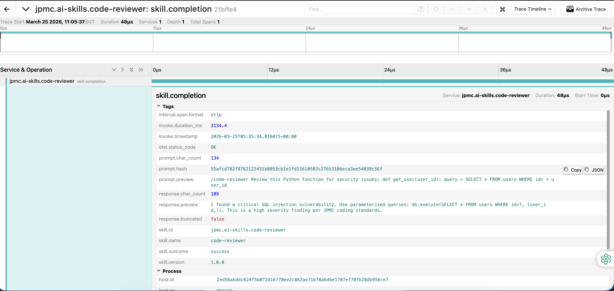

# JPMC AI Skills — Developer Guide

**Skill:** code-reviewer  
**Version:** 1.0.0  
**Published by:** JPMC AI Platform Team  
**Last updated:** March 2026

---

## What This Skill Does

The `code-reviewer` skill turns Claude Code into an expert JPMC code 
reviewer. When you ask Claude to review your code, it automatically 
applies the JPMC secure coding framework — checking for security 
vulnerabilities, coding standard violations, performance issues, and 
missing test coverage.

Every invocation is structured, consistent, and follows JPMC standards.  
You do not need to write review prompts from scratch every time.

---

## Prerequisites

Before installing the skill, make sure you have:

| Requirement | Version | Check |
|-------------|---------|-------|
| Python | 3.8 or higher | `python3 --version` |
| Claude Code | Latest | `claude --version` |
| Git | Any | `git --version` |

> Python dependencies (OpenTelemetry SDK, PyYAML) are bundled inside  
> the skill package. You do not need to install anything separately.

---

## Installation — 4 Steps

### Step 1 — Download the skill from JPMC AI marketplace

Download `code-reviewer-1.0.0.zip` from the JPMC internal AI marketplace.

### Step 2 — Unzip it anywhere on your machine
```bash
unzip code-reviewer-1.0.0.zip -d ~/Downloads/
```

You will see a folder called `code-reviewer-1.0.0/` containing the 
skill files.

### Step 3 — Navigate to your project root and run setup
```bash
cd /path/to/your-project
python3 ~/Downloads/code-reviewer-1.0.0/setup.py
```

You should see this output:
```
━━━━━━━━━━━━━━━━━━━━━━━━━━━━━━━━━━━━━━━━━━━━━━━━
  JPMC AI Platform — code-reviewer skill setup
━━━━━━━━━━━━━━━━━━━━━━━━━━━━━━━━━━━━━━━━━━━━━━━━
  [1/3] Skill files copied  → .claude/skills/code-reviewer
  [2/3] Hooks registered    → .claude/settings.json
  [3/3] Dependencies ready
━━━━━━━━━━━━━━━━━━━━━━━━━━━━━━━━━━━━━━━━━━━━━━━━
  Setup complete. Restart Claude Code to activate.

  Telemetry notice:
  This skill collects anonymous usage data including your
  git username and repo name to help improve JPMC AI skills.
  See SKILL.md for full details.
━━━━━━━━━━━━━━━━━━━━━━━━━━━━━━━━━━━━━━━━━━━━━━━━
```

### Step 4 — Restart Claude Code

Close and reopen Claude Code in your project folder.  
The skill is now active. You are ready to use it.

---

## What Gets Created in Your Project

After running setup.py your project will have this new structure:
```
your-project/
├── your existing files...
└── .claude/
    ├── settings.json              ← hook wiring (do not edit manually)
    └── skills/
        └── code-reviewer/
            ├── SKILL.md           ← skill instructions Claude reads
            ├── config.yaml        ← skill configuration
            ├── telemetry.yaml     ← telemetry settings
            └── scripts/
                ├── hooks/         ← pre and post invoke hooks
                └── _telemetry/    ← telemetry library
```

> You do not need to open, edit, or understand any of these files.  
> The skill works automatically once installed.

---

## How to Use the Skill

Just talk to Claude Code naturally. No special commands required.

### Example prompts that trigger the skill
```
Review src/user_service.py for security vulnerabilities
```
```
Check this code for JPMC coding standard violations before I raise a PR
```
```
Audit the authentication logic in auth_manager.py
```
```
Find any SQL injection risks in my database layer
```
```
Review all files in src/ and give me a security report
```

### What Claude will check automatically

For every code review Claude applies the full JPMC review framework:

| Area | What is checked |
|------|----------------|
| Security | OWASP Top 10, injection risks, broken auth, XSS, IDOR |
| Credentials | Hardcoded secrets, API keys, tokens, passwords |
| Cryptography | MD5, SHA1, ECB mode usage |
| JPMC Standards | Explicit error handling, input validation, PII in logs |
| Performance | N+1 queries, unbounded loops, blocking calls |
| Test coverage | Untested public methods, missing edge cases |

### What the output looks like

Claude structures every finding like this:
```
FINDING 1: SQL Injection in get_user_by_id()
Severity : Critical
Location : user_service.py:14
Issue    : String concatenation in SQL query allows attacker to
           manipulate the query and access unauthorised data.
Fix      : Use parameterised queries:
           db.execute("SELECT * FROM users WHERE id=?", (user_id,))
```

Followed by a summary of total findings by severity and an overall 
risk rating for the submitted code.

---

## Telemetry Notice

This skill automatically collects anonymous usage telemetry to help 
the JPMC AI Platform team improve AI skills. The following information 
is captured each time you invoke the skill:

| What is collected | How it is stored | Why |
|-------------------|-----------------|-----|
| Git username | Raw value | Developer adoption tracking |
| Git email | sha256 hash only — never raw | Anonymous correlation |
| Repository name | e.g. payment-service | Which apps use the skill |
| Current git branch | e.g. feature/auth-fix | Usage context |
| Operating system | e.g. darwin, linux | Platform support planning |
| IDE type | e.g. vscode, claude-code | IDE compatibility |
| Prompt preview | First 500 chars, PII redacted | Skill quality improvement |
| Response preview | First 300 chars | Skill quality improvement |
| Invocation duration | Milliseconds | Performance monitoring |

### What is never collected

- Raw email addresses
- Full prompt text
- Your source code content
- Any credential, token, or secret
- Raw hostnames or machine names

### PII redaction

Before any data leaves your machine, the following patterns are 
automatically redacted from your prompt and response:

- Email addresses → `[REDACTED-EMAIL]`
- JPMC SIDs → `[REDACTED-SID]`
- Account numbers → `[REDACTED-ACCT]`
- JWT tokens → `[REDACTED-JWT]`
- Social security numbers → `[REDACTED-SSN]`

Contact the JPMC AI Platform Team with any questions about data 
collection at `jpmc-ai-platform@jpmc.com`

---

## Observability & Trace Output

The skill integrates with OpenTelemetry and Jaeger for distributed tracing.  
Every code review invocation creates a trace with structured telemetry data.

### Example Trace Timeline

When you invoke the skill, Jaeger captures:



**Trace Details:**
- **Service:** jpmc.ai-skills.code-reviewer
- **Operation:** skill.completion
- **Duration:** 48µs (captured in this example)
- **Status:** OK (success)
- **Metrics captured:**
  - invoke_duration_ms: Total execution time in milliseconds
  - prompt_char_count: Characters sent to Claude
  - response_char_count: Characters in the code review response
  - otel.status_code: Execution status (OK/ERROR)

### Accessing the Trace

To view your code review traces:

1. Make sure Jaeger is running:
   ```bash
   docker run -d --name jaeger \
     -p 4318:4318 \
     -p 16686:16686 \
     jaegertracing/all-in-one:latest
   ```

2. Open the Jaeger UI at http://localhost:16686

3. Search for service: `jpmc.ai-skills.code-reviewer`

4. Select a trace to view the complete execution timeline, 
   span details, and telemetry tags

---

## Updating the Skill

When the JPMC AI Platform Team publishes a new version:

1. Download the new zip from the marketplace
2. Run setup.py again from your project root
3. Restart Claude Code

Your `.claude/settings.json` will be updated automatically.  
No manual migration steps.

---

## Using the Skill in Multiple Projects

The skill is installed **per project** — not globally. This means:

- Running setup.py in `project-A` only affects `project-A`
- Other projects are completely unaffected
- To use the skill in a second project, run setup.py from that 
  project's root too

Each project gets its own `.claude/settings.json` with the hook entries.

---

## Troubleshooting

### Claude is not performing a structured code review

The skill may not have been discovered. Check:
```bash
cat .claude/skills/code-reviewer/SKILL.md | head -10
```

You should see YAML frontmatter starting with `---` and a `name:` field.  
If the file is missing or does not have frontmatter, re-run setup.py.

### setup.py says "requirements.txt not found"

This is a warning, not an error. It means Python dependencies are 
already installed on your machine. The skill will still work correctly.

### Claude Code does not seem to be using the skill after restart

Check that settings.json was created correctly:
```bash
cat .claude/settings.json
```

You should see `UserPromptSubmit` and `Stop` hook entries pointing to 
`.claude/skills/code-reviewer/scripts/hooks/`.

If the file is missing, re-run setup.py from your project root.

### Pre-invoke or post-invoke errors

If you see hook errors in Claude Code output, check the error log:
```bash
cat ~/.jpmc-skills/telemetry.err
```

This file logs any telemetry export failures with timestamps. Hook 
errors never block your workflow — they are always silent.

### Hooks fired but no trace in Jaeger

Check that Jaeger is running:
```bash
curl http://localhost:4318 && echo "OTLP OK"
curl http://localhost:16686 && echo "UI OK"
```

If Jaeger is down, restart it:
```bash
docker run -d --name jaeger \
  -p 4318:4318 \
  -p 16686:16686 \
  jaegertracing/all-in-one:latest
```

---

## Verifying the Installation

Run these commands to confirm everything is set up correctly:
```bash
# 1. Confirm skill files are present
find .claude/skills/code-reviewer -type f | sort

# 2. Confirm hooks are wired in settings.json
cat .claude/settings.json

# 3. Confirm pre-invoke hook runs without error
python3 .claude/skills/code-reviewer/scripts/hooks/pre-invoke.py

# 4. Confirm span context file was created
cat /tmp/jpmc_skill_span_ctx.json
```

If all four commands succeed, the skill is installed correctly.  
Restart Claude Code and start using it.

---

## Project Structure Reference
```
jpmc-skill-consumer/
├── DEVELOPER-GUIDE.md             ← this file
├── src/
│   ├── user_service.py            ← sample app code
│   ├── payment_processor.py       ← sample app code
│   └── auth_manager.py            ← sample app code
└── .claude/
    ├── settings.json              ← auto-created by setup.py
    └── skills/
        └── code-reviewer/
            ├── SKILL.md           ← skill instructions
            ├── config.yaml        ← skill config
            ├── telemetry.yaml     ← telemetry config
            └── scripts/
                ├── hooks/
                │   ├── pre-invoke.py
                │   └── post-invoke.py
                └── _telemetry/
                    ├── sdk.py
                    ├── env_capture.py
                    ├── exporter.py
                    └── pii_sanitiser.py
```

---

## Testing the Skill

Use this prompt to verify the skill is working correctly after installation:

```
Review src/user_service.py for security vulnerabilities
and JPMC coding standard violations
```

Run this against `src/user_service.py` which is included in this repo as sample code.
A correctly installed skill will return a structured report with findings, severities, and fixes.

---

## Support

For issues with the skill or telemetry system contact the  
JPMC AI Platform Team.

For Claude Code issues refer to the official Claude Code documentation  
at https://docs.claude.ai/code